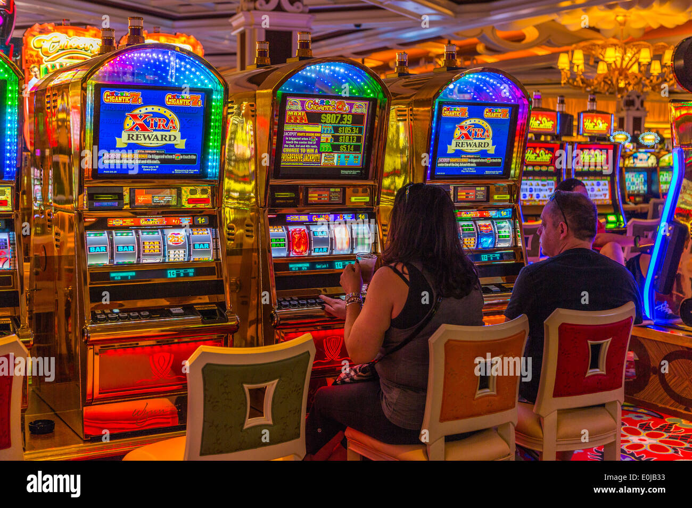

<!DOCTYPE html>
<html lang="en">

<head>
  <meta charset="UTF-8">
  <meta http-equiv="X-UA-Compatible" content="IE=edge">
  <meta name="viewport" content="width=device-width, initial-scale=1.0">
  <link href="https://cdn.jsdelivr.net/npm/bootstrap@5.2.0-beta1/dist/css/bootstrap.min.css" rel="stylesheet"
    integrity="sha384-0evHe/X+R7YkIZDRvuzKMRqM+OrBnVFBL6DOitfPri4tjfHxaWutUpFmBp4vmVor" crossorigin="anonymous">
  <link rel="stylesheet" href="style.css">

  <title>formularios </title>
</head>

<body>
  

    

      

        <h1>BINGO DE COSTA RICA </h1>
      

    

    

      

        <form>
          <fieldset disabled>
            
 

            <h3>Todavia No Tenes Cuenta? Resgistrate</h3>
            

              <label for="disabledTextInput" class="form-label">Crear Cuenta </label>
              <input type="text" id="disabledTextInput" class="form-control" placeholder="Email">
            

            

              <label for="disabledSelect" class="form-label">contraseña</label>
              <select id="disabledSelect" class="form-select">
                <option>**********</option>
              </select>
            

            

            

            <button type="submit" class="btn btn-danger">Registrate</button>
          </fieldset>
        </form>
        

          <label class="form-check-label" for="disabledFieldsetCheck">
            Ingresar a tu cuenta <a href="formulario1.html">Iniciar</a>
          </label>
        

      

      

        
      

    

</body>
<script src="https://cdn.jsdelivr.net/npm/bootstrap@5.2.0-beta1/dist/js/bootstrap.bundle.min.js"
  integrity="sha384-pprn3073KE6tl6bjs2QrFaJGz5/SUsLqktiwsUTF55Jfv3qYSDhgCecCxMW52nD2" crossorigin="anonymous"></script
</html>
